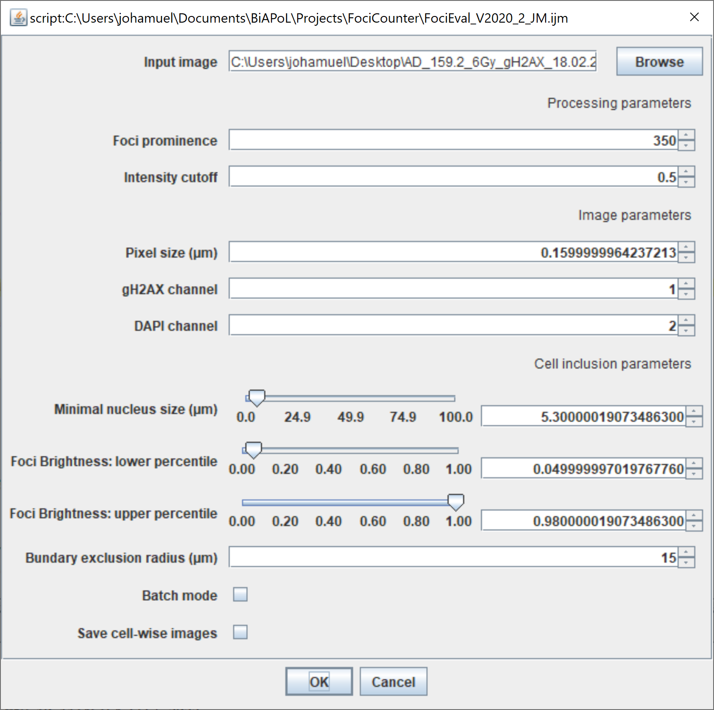
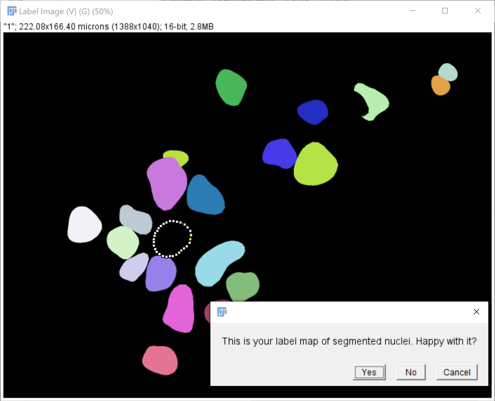
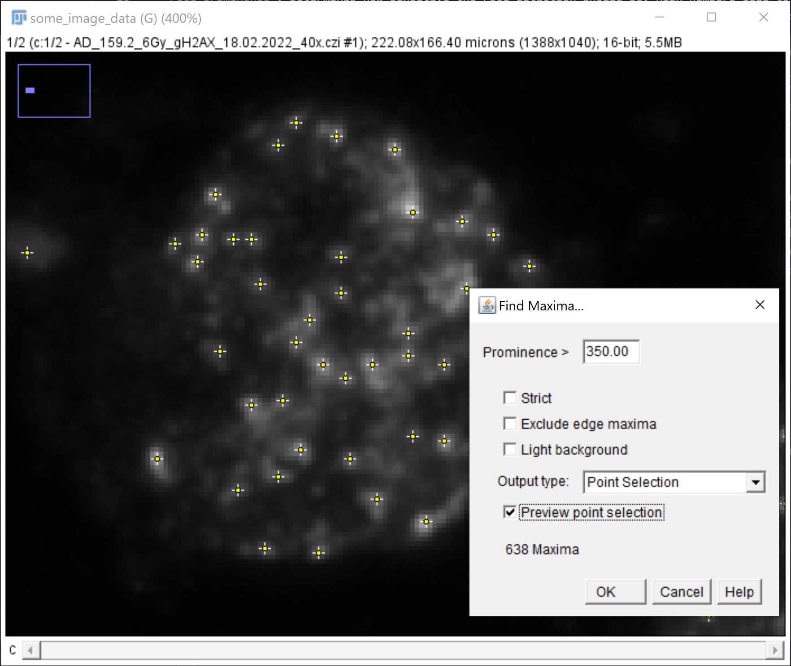
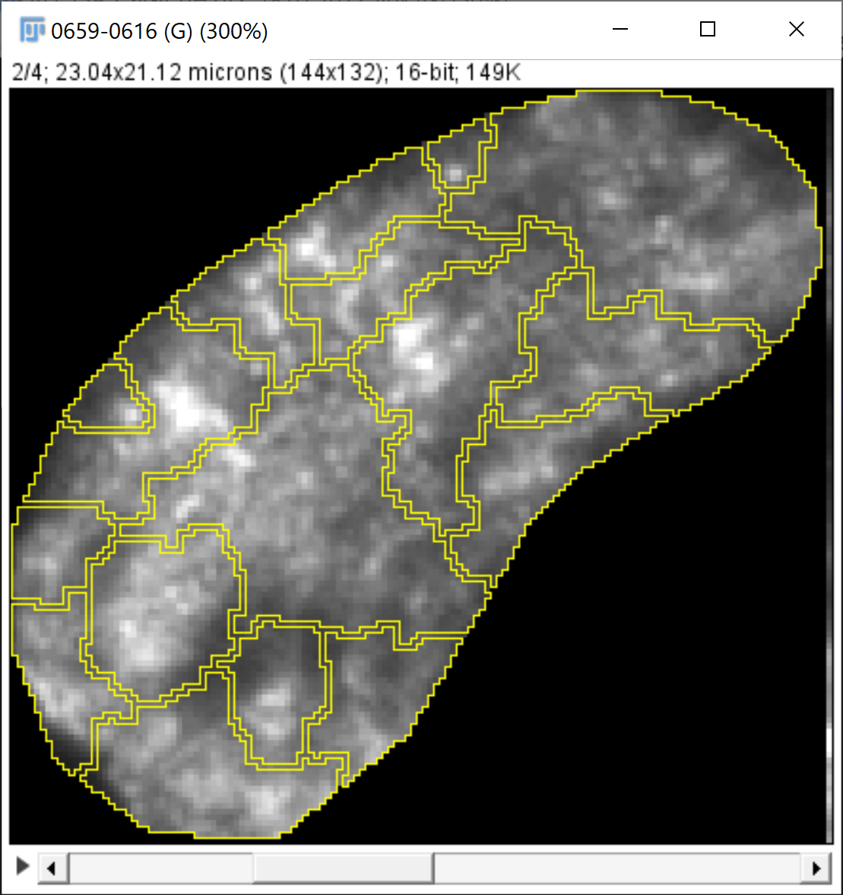
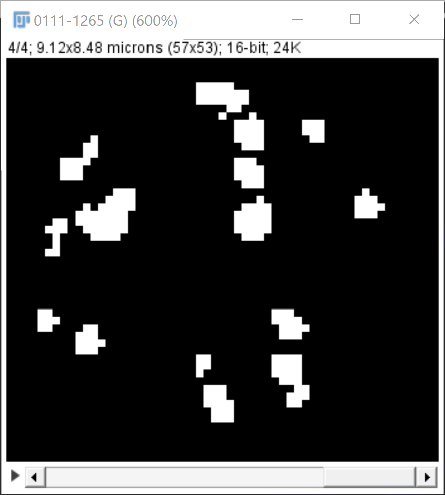

# FociCounter
Performs auto-segmentation of cell nuclei and measures the number and size of radiation induced DNA lessions within the nucleus.

## Usage
In order to use this script, download [Fiji](https://imagej.net/software/fiji/downloads) and update it (`Help > Update...`). After restarting Fiji, run the update command again and add StarDist to the update sites as [shown here](https://imagej.net/plugins/stardist). Then, open the script by drag & dropping the file `FociEval_V2020_2_JM.ijm` onto the Fiji toolbar. Click `Run` to start the script. 

A user interface will then pop up:
]

Parameters to be set and what they do:

* `Input image`: file path to a n-channel image, out of which one should be a DAPI staining and the other one showing the DNA lessions ("foci").
* `Foci prominence`: Determines how sensitive the Foci detection should be. High numbers lead to fewer detected foci, low numbers yield more foci detections. It is highly encouraged to optimize this parameter before using this script. To do so, use the `Process > Find Maxima > ..` function from the Fiji toolbar, set the output type to `Point Selection` and check the `Preview point selection` box. ou can then try different prominence value. 
* `Intensity cutoff`: Determines which part around a detected foci will be counted as part of the foci and which is not. If set to `0.5` (which is suggested), this parameter corresponds to a [full-width at half maximum](https://en.wikipedia.org/wiki/Full_width_at_half_maximum) area criterion.
* `Pixel size`: Check if correct - to validate, open your image and press `Ctrl + I` to inspect the metadata of your image.
* `gH2AX` channel: Number of slice in the stack of channels that contains the image with the foci.
* `DAPI` channel: Number of slice in the stack of channels that contains the DAPI staining. (*Note*: Start counting at 1)
* `Minimal nucleus size`: Exclude nuclei smaller than this size from the analysis
* `Foci brightness (lower percentile)`: The brightness of all foci in the image is measured and nuclei with a brightness lower than this value will be excluded from the analysis
* `Foci brightness (upper percentile)`: The brightness of all foci in the image is measured and nuclei with a brightness higher than this value will be excluded from the analysis. It makes sense to use this parameter to exclude, i.e., dividing nuclei from the analysis.
* `Boundary exclusion radius`: Cells this close to the edge of the image will be excluded from the analysis.
* `Batch mode`: Hides the processing in the background if checked - also makes the analysis faster.
* `Save cell wise images`: Saves a copy of the DAPI staining, the foci staining and the derived segmentations of the nucleus and the foci in a separate image for introspection.

## How itworks
This section describes in brief what the script does and how it works.

1. A sementation of the nuclei is first obtained with the StarDist plugin and some of the nuclei are excluded according to the above-described parameters. You are prompted with a review dialogue to approve:

]

2. The script iterates over every nucleus and detects the local maxima in the gH2AX-channel according to the prominence parameter above:

]

3. A tesselation of the nucleus with the foci positions as centers is then created to split the nucleus into separate foci-assigne dregions. The background (defined as lower 5% quartile) and the maximum intensity are then measured for every foci.

]

4. The size of the foci are measured by setting a threshold at `BG + 0.5 * ( Max - BG)` for each foci region, where `Max` is the intensity maximum of each foci and `BG` is the local background around each foci.

]

## Citation

If you use this tool for your analysis, please cite the following sources:

[1] Uwe Schmidt, Martin Weigert, Coleman Broaddus, and Gene Myers. Cell Detection with Star-convex Polygons. International Conference on Medical Image Computing and Computer-Assisted Intervention (MICCAI), Granada, Spain, September 2018.

[2] Rassamegevanon, T., Feindt, L., Koi, L., Müller, J., Freudenberg, R., Löck, S., Sihver, W., Çevik, E., Kühn, A. C., von Neubeck, C., Linge, A., Pietzsch, H. J., Kotzerke, J., Baumann, M., Krause, M., &#38; Dietrich, A. (2021). Molecular Response to Combined Molecular- and External Radiotherapy in Head and Neck Squamous Cell Carcinoma (HNSCC). <i>Cancers 2021, Vol. 13, Page 5595</i>, <i>13</i>(22), 5595. https://doi.org/10.3390/CANCERS13225595

## Acknowledgements

Image data for documentation: Alina Dornack, OncoRay, Tumor Pathophysiology group, Dresden, Germany
